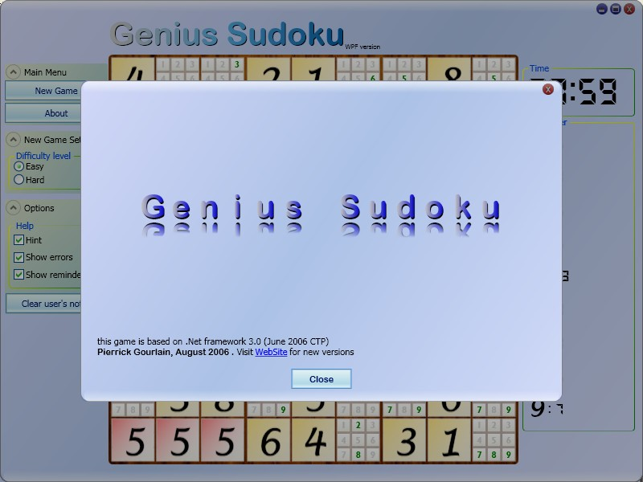

**Project Description**
une implementation en C# du célèbre jeu "Sudoku", pour les plateforme PPC et windows, et WPF 

une nouvelle version va bientôt voir le jour (pour silverlight 2.0b1) 'stay tunes' [http://blogs.developpeur.org/pierrick/](http://blogs.developpeur.org/pierrick/)
en avant première un aperçu

Une version Silverlight 2b2 est disponible [http://blogs.developpeur.org/pierrick/archive/2008/06/24/sudoku-silverlight-2b2.aspx](http://blogs.developpeur.org/pierrick/archive/2008/06/24/sudoku-silverlight-2b2.aspx)